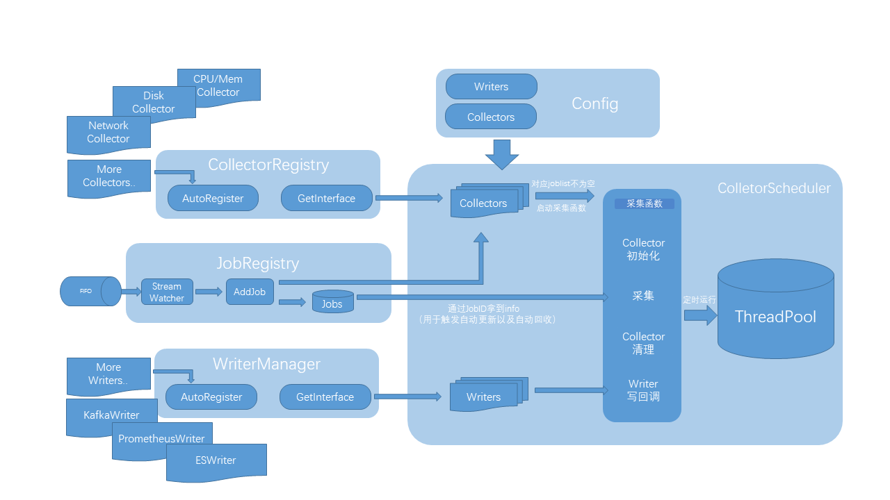

# JobLens 🎯

高性能分布式作业监控与性能分析系统

## 📋 项目简介

JobLens是一个专为高性能计算(HPC)环境设计的分布式作业监控和性能分析系统。它能够实时监控作业的资源使用情况，提供详细的性能指标，并支持多种数据导出格式，帮助用户深入了解作业运行状态和系统性能瓶颈。

### 核心能力
- **实时作业监控**: 跟踪作业的完整生命周期
- **多维度性能收集**: CPU、内存、I/O、网络全方位监控
- **eBPF细粒度监控**: 文件IO、系统调用等内核级追踪
- **插件化设计**: 灵活的收集器和写入器架构
- **多格式导出**: 支持Prometheus、Elasticsearch、Kafka、文件输出
- **数据库持久化**: SQLite持久化存储，服务注册中心
- **规则引擎**: 基于Lua的自定义规则处理
- **服务注册中心**: 多实例管理、健康检查、自动发现

## 🏗️ 系统架构



### 核心组件

#### 1. 作业信息收集器
- **生命周期管理**: 跟踪作业的创建、运行、结束全过程
- **插件化架构**: 支持动态加载和卸载收集器
- **并发处理**: 多线程并发收集，保证性能

#### 2. 多维度收集器
- **CPU/内存收集器**: 资源使用率实时统计
- **I/O收集器**: 磁盘读写性能分析
- **网络收集器**: 网络流量和连接监控
- **BPF收集器**: eBPF内核级性能监控
- **基础信息收集器**: 轻量级进程基础信息收集
- **任务统计收集器**: 进程级任务统计信息

#### 3. 数据写入器
- **Prometheus导出器**: 标准metrics格式，兼容Grafana
- **Elasticsearch写入器**: 全文检索和日志分析
- **Kafka写入器**: 高吞吐量消息队列写入
- **文件写入器**: 本地日志和JSON导出
- **InfluxDB写入器**: 时间序列数据库写入
- **Condor ClassAds写入器**: HTCondor集成写入

#### 4. 规则引擎
- **Lua脚本支持**: 自定义数据过滤和处理规则
- **动态加载**: 支持运行时规则更新
- **条件触发**: 基于性能阈值的自动动作

#### 5. 服务注册中心
- **服务发现**: 多实例自动注册与发现
- **健康检查**: 定期心跳检测与状态监控
- **持久化存储**: SQLite数据库持久化，支持重启恢复
- **负载均衡**: 服务实例间的负载分发

#### 6. 数据库持久化层
- **SQLite集成**: 轻量级嵌入式数据库
- **作业状态持久化**: 系统重启后作业状态恢复
- **配置管理**: 运行时配置的持久化存储

## 🚀 功能特性

### 核心功能
- ✅ **实时作业监控**: 毫秒级延迟的状态更新
- ✅ **多作业支持**: 同时监控数百个作业
- ✅ **分布式部署**: 支持多节点集群部署
- ✅ **高可用性**: 主从切换，故障自愈
- ✅ **插件扩展**: 自定义收集器和写入器
- ✅ **性能优化**: C++17实现，高效内存管理
- ✅ **数据库持久化**: SQLite持久化存储，重启自动恢复
- ✅ **规则引擎**: 基于Lua的自定义规则处理
- ✅ **服务注册中心**: 多实例管理、健康检查、自动发现
- ✅ **自动配置更新**: 运行时动态配置更新

### 高级特性
- 🔧 **eBPF支持**: 内核级性能数据收集，文件IO细粒度监控
- 🔧 **HTCondor集成**: 专为HTCondor集群优化，自动作业添加
- 🔧 **RESTful API**: 完整的HTTP接口，支持作业管理、性能查询
- 🔧 **Web Dashboard**: 实时性能展示
- 🔧 **告警机制**: 异常状态自动通知
- 🔧 **历史分析**: 长期趋势分析和报告
- 🔧 **Prometheus集成**: 标准metrics格式，兼容Grafana
- 🔧 **Kafka集成**: 高吞吐量数据管道
- 🔧 **性能计数器**: 采集器和写入器性能统计
- 🔧 **作业槽接口**: 通过作业槽动态添加作业
- 🔧 **自动升级**: 支持远程版本升级

### 性能指标
- **收集延迟**: < 1秒
- **处理能力**: 支持192+并发作业监控
- **内存占用**: < 500MB (100作业场景)
- **CPU占用**: < 5% (空闲状态)

## 📦 安装部署

### 系统要求
- **操作系统**: Linux (CentOS 7+, Ubuntu 16.04+)
- **编译器**: GCC 7+ 或 Clang 8+
- **CMake**: 3.16+
- **内存**: 最少2GB，推荐4GB+
- **网络**: 支持TCP/IP网络通信

### 快速安装

#### 方式一：源码编译安装

##### 1. 获取源码
```bash
git clone https://github.com/nowzycc/JobLens.git
cd JobLens
```

##### 2. 编译构建
```bash
mkdir build && cd build
cmake ..
make -j$(nproc)
```

##### 3. 系统部署
```bash
# 安装到系统目录（可选）
sudo make install

# 或者使用部署脚本
sudo ./scripts/deploy.sh all
```

#### 方式二：脚本自动化安装

##### 1. 下载安装脚本
```bash
wget -O install.sh http://<服务器地址>/joblens/install.sh
chmod +x install.sh
```

##### 2. 运行安装脚本
```bash
# 默认安装最新版本
sudo ./install.sh

# 指定版本安装
sudo VERSION=0.0.12 ./install.sh

# 指定安装部分
sudo DEPLOY_PART=joblens ./install.sh  # 仅安装JobLens主程序
sudo DEPLOY_PART=trigger ./install.sh  # 仅安装Trigger服务
```

##### 3. 验证安装
```bash
# 检查JobLens服务状态
systemctl status joblens

# 检查Trigger服务状态
systemctl status joblens-trigger

# 测试健康检查
curl http://localhost:7592/joblens/healthy
```

#### 环境变量配置
安装脚本支持以下环境变量：
- `INSTALL_PREFIX`: 安装目录（默认：`/opt/JobLens`）
- `VERSION`: 版本选择（`latest`, `test` 或具体版本号）
- `DEPLOY_PART`: 部署部分（`all`, `joblens`, `trigger`）
- `NGINX_HOST`: 包服务器地址（默认：`your-package-server:8888`）

## ⚙️ 配置说明

### 主配置文件 (`config/config.yaml`)
```yaml
lens_config:
  rpc_socket_path: /var/JobLens/rpc.sock
  rpc_timeout: 5
  lock_path: /var/JobLens/JobLens.lock
  pid_dir: /var/JobLens/node_pids
  max_collector_threads: 8
  log_level: info

job_registry_config:
  job_db_path: /var/JobLens/job.db
  auto_add_condorjob: true
  auto_add_collectors:
    - cpumem_collector
    - net_collector
    - io_collector

writers_config:
  enable_writer_perf: true
  perf_window_size: 1000
  buffer_capacity: 4096
  writers:
    - name: es_writer
      type: ESWriter
      config: ES_writer_config
    - name: prmxs_writer
      type: PrometheusExporterWriter
      config: prmxs_writer_config
    - name: kafka_writer
      type: KafkaWriter
      config: kafka_writer_config

collectors_config:
  enable_collector_perf: true
  perf_window_size: 1000
  job_adder_fifo: /var/JobLens/job_adder_fifo
  default_freq: 1
  default_use_writers:
    - es_writer
  collectors:
    - name: proc_collector
      type: ProcCollector
      config: proc_collector_config
    - name: cpumem_collector
      type: CPUMemCollector
      config: cpumem_collector_config
    - name: net_collector
      type: NetUsageCollector
      config: net_collector_config
    - name: io_collector
      type: IOUsageCollector
      config: io_collector_config
    - name: basic_info_collector
      type: BasicInfoCollector
      config: basic_info_collector_config

# 更多配置示例请参考 config/config.yaml 完整文件
```

### 启动参数

```bash

# 服务模式启动

./JobLens -m service -c config.yaml


# 显示版本信息

./JobLens -v


# 显示帮助信息

./JobLens -h

```


更多选项请使用 `./JobLens -h` 查看完整帮助。

## 🔍 使用方法

### 1. 基本作业监控
```bash
# 启动后台服务
./JobLens -m service -c config/config.yaml
```

### 2. API接口使用

#### 健康检查
```bash
curl -X GET http://localhost:7592/joblens/healthy
```

#### 服务注册与发现
```bash
# 注册服务实例
curl -X POST http://localhost:7592/joblens/service_register \
  -H "Content-Type: application/json" \
  -d '{
    "service_name": "joblens-node-1",
    "host": "10.0.0.1",
    "port": 7592,
    "metadata": {"version": "0.0.12"}
  }'

# 发现可用服务
curl -X GET http://localhost:7592/joblens/service_discover
```

#### 作业管理
```bash
# 获取所有作业
curl -X GET http://localhost:7592/joblens/jobs

# 获取特定作业信息
curl -X GET http://localhost:7592/joblens/jobs/1001

# 动态添加作业
curl -X POST http://localhost:7592/joblens/jobs \
  -H "Content-Type: application/json" \
  -d '{
    "opt": "add",
    "type": "job.common",
    "JobID": 1001,
    "JobPIDs": [1234],
    "Lens": ["proc_collector", "cpumem_collector"]
  }'
```

#### 性能监控
```bash
# 收集器性能统计
curl -X GET http://localhost:7592/joblens/collectors/perf

# 写入器性能统计
curl -X GET http://localhost:7592/joblens/writers/perf

# Prometheus指标
curl -X GET http://localhost:7592/metrics
```

#### 配置管理
```bash
# 获取当前配置
curl -X GET http://localhost:7592/joblens/config

# 更新配置
curl -X PUT http://localhost:7592/joblens/config \
  -H "Content-Type: application/json" \
  -d '{"log_level": "debug"}'
```

#### 规则引擎
```bash
# 获取所有规则
curl -X GET http://localhost:7592/joblens/rules

# 添加规则
curl -X POST http://localhost:7592/joblens/rules \
  -H "Content-Type: application/json" \
  -d '{
    "rule_id": "high_cpu_alert",
    "lua_script": "if cpu_usage > 90 then return 'ALERT' end"
  }'
```

#### 系统升级
```bash
# 远程升级
curl -X POST http://localhost:7592/joblens/upgrade \
  -H "Content-Type: application/json" \
  -d '{"version": "0.0.12"}'
```

默认端口：`7592`，可在配置文件中修改。

### 3. HTCondor集成

JobLens 深度集成 HTCondor 集群监控，支持自动发现和监控 Condor 作业。

#### 自动作业添加
在配置文件中设置 `auto_add_condorjob: true`，JobLens 将自动监控所有 Condor 作业：
```yaml
job_registry_config:
  auto_add_condorjob: true
  auto_add_collectors:
    - cpumem_collector
    - net_collector
    - io_collector
```

#### 手动集成
```bash
# 在HTCondor启动脚本中添加
./JobLens -m service -c config.yaml &

# 作业提交时自动注册
condor_submit job.sub
```

#### Condor ClassAds 写入器
JobLens 支持将监控数据写回 Condor ClassAds，方便在 Condor 界面中查看：
```yaml
writers:
  - name: condor_classads_writer
    type: CondorClassAdsWriter
    config: condor_classads_writer_config
```

更多集成细节请参考 HTCondor 文档和示例配置。

## 🧪 测试验证

### 基础功能测试
```bash
cd test
python3 test_cli.py               # CLI功能测试
python3 test_remote.py            # 远程连接测试
python3 fork_test.py              # 进程fork测试
python3 net_collect_test.py       # 网络收集器测试
python3 disk_collect_test.py      # 磁盘收集器测试
```

### 压力测试
```bash
# 压力测试
pip install psutil matplotlib numpy
python3 test_stress.py            # 系统压力测试
python3 workload_simulate.py      # 工作负载模拟
```

### 性能测试
```bash
# 收集器性能测试
./scripts/perf_joblens.sh

# 脚本性能测试
python3 test_cli.py --performance
```

注：运行测试前请确保 JobLens 服务已启动并配置正确。

## 📊 性能数据展示

### Prometheus + Grafana
```yaml
# prometheus.yml
scrape_configs:
  - job_name: 'joblens'
    static_configs:
      - targets: ['localhost:7592']
```

### 关键指标
- `htcondor_job_state`: 作业状态分布
- `joblens_cpu_usage`: CPU使用率
- `joblens_memory_usage`: 内存使用量
- `joblens_io_read_bytes`: I/O读取量
- `joblens_network_rx_bytes`: 网络接收量

## 🔧 开发扩展

### 自定义收集器
```cpp
#include "icollector.h"

// 调用自动注册宏
AUTO_REGISTER_COLLECTOR(
    IOUsageCollector, 
    "This is a help text",
    ConfigParams{
        {"param1", "param1 help text"},
        {"param2", "param2 help text"},
    }
)

// 继承接口
class MyCollector : public ICollector {
public:
    void collect(const Job& job) override {
        // 实现收集逻辑
    }
    
    std::string name() const override {
        return "my_collector";
    }
};
```

### 自定义写入器
```cpp
class MyWriter : public BaseWriter {
protected:
    void flush_impl(const std::vector<write_data>& batch) override {
        // 实现写入逻辑
    }
};
```

## 📚 项目结构

```
JobLens/
├── CMakeLists.txt              # 构建配置
├── README.md                   # 项目文档
├── CHANGELOG.md                # 变更日志
├── config/                     # 配置文件
│   ├── config.yaml            # 主配置文件
│   ├── jobs_opt_temp.json     # 临时作业配置
│   ├── rule.lua               # 规则引擎示例
│   └── sys_collect_opt_temp.json
├── include/                    # 头文件目录
│   ├── collector/             # 收集器接口与实现
│   ├── common/                # 公共组件（配置、工具、RPC等）
│   ├── core/                  # 核心组件（注册表、调度器）
│   ├── ebpf/                  # eBPF相关定义
│   ├── thirdparty/            # 第三方库（cxxopts, httplib, nlohmann/json）
│   └── writer/                # 写入器接口与实现
├── src/                        # 源码目录
│   ├── main.cpp               # 主程序入口
│   ├── collector/             # 收集器实现（CPU/内存、I/O、网络等）
│   ├── common/                # 公共组件实现
│   ├── core/                  # 核心组件实现
│   ├── ebpf/                  # eBPF程序源码（.bpf.c）
│   └── writer/                # 写入器实现（ES、Prometheus、Kafka等）
├── scripts/                    # 脚本工具
│   ├── install.sh             # 安装脚本
│   ├── deploy.sh              # 部署脚本
│   ├── joblens_cli.py         # CLI工具
│   ├── joblens_watchdog.py    # 看门狗脚本
│   ├── JSRC.py                # 服务注册中心
│   └── perf_joblens.sh        # 性能测试脚本
├── test/                       # 测试文件
│   ├── test_cli.py            # CLI功能测试
│   ├── test_remote.py         # 远程连接测试
│   ├── test_stress.py         # 压力测试
│   ├── fork_test.py           # 进程fork测试
│   ├── net_collect_test.py    # 网络收集器测试
│   ├── disk_collect_test.py   # 磁盘收集器测试
│   └── workload_simulate.py   # 工作负载模拟
├── trigger/                    # 触发器服务（Flask应用）
│   ├── app.py                 # 主应用
│   ├── config_manager.py      # 配置管理
│   ├── rpc_client.py          # RPC客户端
│   ├── user_config.py         # 用户配置
│   ├── api/                   # API路由
│   └── core/                  # 核心逻辑
├── doc/                        # 文档
│   └── img/                   # 图片资源
├── thirdparty/                 # 第三方依赖
│   └── SQLiteCpp/             # SQLite C++封装库
└── build/                      # 构建输出目录（可选）
```

## 🤝 贡献指南

### 开发环境搭建
```bash
# 安装开发依赖
sudo apt-get install build-essential cmake git
sudo apt-get install libyaml-cpp-dev libcurl4-openssl-dev

# 获取源码
git clone https://github.com/nowzycc/JobLens.git
cd JobLens

# 构建项目
mkdir build && cd build
cmake -DCMAKE_BUILD_TYPE=Debug ..
make -j$(nproc)
```

### 代码规范
- 使用C++17标准
- 遵循Google C++ Style Guide
- 函数和类必须有文档注释
- 新增功能需要配套测试

### 提交规范
```
type(scope): subject

body

footer
```

类型说明:
- `feat`: 新功能
- `fix`: 修复bug
- `docs`: 文档更新
- `style`: 代码格式
- `refactor`: 重构
- `test`: 测试相关
- `chore`: 构建/工具

## 📄 许可证

本项目基于 Apache-2.0 许可证开源，详见 [LICENSE](LICENSE) 文件。

## 🆘 支持与联系

### 问题反馈
- 提交Issue: [GitHub Issues](https://github.com/nowzycc/JobLens/issues)
- 邮件联系: maintainer@example.com

### 技术支持
- 文档: [Wiki](https://github.com/nowzycc/JobLens/wiki)
- 讨论: [Discussions](https://github.com/nowzycc/JobLens/discussions)

### 更新日志
详见 [CHANGELOG.md](CHANGELOG.md)

---

**JobLens** - 让作业监控更简单，让性能分析更精准！ 🚀
