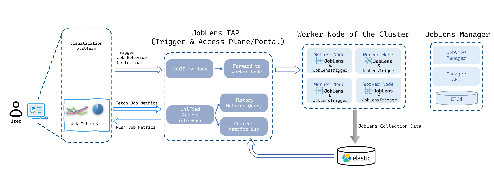
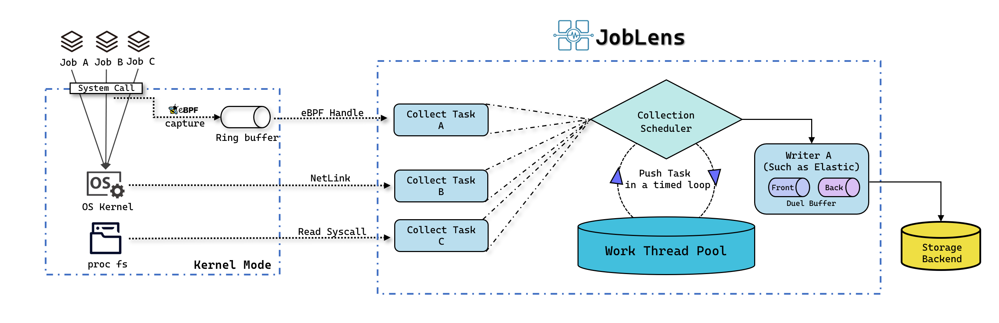

# JobLens Minimal Deployment Kit (Agent + Agent Trigger)

> **Document Version**: v1.0.0  
> **Last Updated**: 2026-04-25  
> **Agent RPM**: joblens-0.0.21-1.el9.x86_64.rpm  
> **Trigger RPM**: joblens-trigger-0.0.13-1.el9.x86_64.rpm  
> **Status**: Production-tested at IHEP, open for cross-site evaluation

## 1. Project Overview

- **JobLens** is a **Job-Native** observability system. The **Agent** is a collection daemon deployed on compute nodes.
- **Goal of this kit**: Rapidly deploy the Agent and local control components on evaluation nodes to enable job-level data collection, basic querying, and forwarding.
- **Target audience**: Site administrators, experiment computing operations teams, and partner institutions evaluating the stack.
- **Current delivery**: RPM packages only. Open-source release of the codebase is in active preparation.

## 2. Glossary

| Component | Description |
|-----------|-------------|
| **JobLens Agent** | The collection daemon running on compute nodes. |
| **JobLens Trigger** | Local control interface for the Agent, responsible for lifecycle management, rule injection, and job metadata registration. *(Internal codename "Trigger" is retained for historical reasons.)* |
| **JobLens Manager** *(not included in this kit)* | Centralized control plane for unified configuration, rule distribution, and operational monitoring. Planned for future release. |

## 3. Architecture at a Glance

### Deployment Topology (IHEP)

Current production deployment at IHEP:


### Data Flow



## 4. System Requirements & Compatibility

**Validated Environment**

- **OS**: AlmaLinux 9 (Kernel `5.14.0-427.el9.x86_64`)
- **Other RHEL 9-compatible distributions** (Rocky Linux 9, CentOS Stream 9) are expected to work but have not been fully tested.  
  *If you run a different OS, please contact us before deployment.*

**Resource Footprint**

- Designed for minimal overhead. On a 256-core production node:
  - **CPU**: **< 0.15%** of total node capacity (~37% of a single logical core)
  - **Memory**: **~145 MB** RSS
- Scales roughly linearly with core count due to per-CPU eBPF maps.

## 5. Quick Start

### 5.0 Prerequisites

- **Operating System**: AlmaLinux 9 (validated). Other RHEL 9-compatible distros are not yet fully tested.
- **Init system**: `systemd` is required for service management.
- **Workload scheduler**: HTCondor compute nodes. *(For evaluation, we recommend setting up a small HTCondor test cluster.)*

**Data Storage: Choose One**

| Option | Description | Use Case |
|--------|-------------|----------|
| **A: Full evaluation (with visualization)** | Deploy your own **Elasticsearch (>= 7.x)** as the data backend. The Python visualization script queries ES. | End-to-end trial with dashboards |
| **B: Agent-only (no ES required)** | The Agent runs standalone and writes to local files. With config `log_level: debug`, you can observe captured metrics in real time via `journalctl -u joblens -f`.<br><br>⚠️ **Caution**: Writing large volumes of job metrics to local files may cause I/O pressure under heavy load. This mode is intended **only for functional testing**, not production use. | Quick functionality check without backend infrastructure |

### 5.1 Install the RPMs

Download the RPM packages, then install:

```bash
sudo dnf install ./joblens-*.el9.x86_64.rpm ./joblens-trigger-*.el9.x86_64.rpm
```

Verify installation paths and binaries:

```bash
rpm -ql joblens joblens-trigger
ls /usr/bin/JobLens
sudo systemctl status joblens-trigger
```

### 5.2 Basic Configuration

Default configurations are shipped with the RPMs. Modify them to match your environment:

- **Agent config**: `/etc/JobLens/config.yaml`
  - Listen address and Trigger communication method
  - Log level and output target
  - Elasticsearch connection parameters
- **Trigger config**: `/etc/JobLens/trigger/config.yaml`
  - Listen port for local API

### 5.3 Start and Health Check

The RPM installation automatically starts both services via `systemd`.

```bash
# Check service status
sudo systemctl status joblens joblens-trigger

# Health check
curl http://localhost:7592/joblens/healthy
```

### 5.4 Visualization

The production web dashboard at IHEP is tightly coupled with internal business logic and is **not yet available** for general deployment.

As an interim solution, we provide a lightweight **Python script** that generates an interactive, auto-refreshing web page using **Plotly**.

**Dependencies**
```bash
pip install plotly requests
```

**Environment variables**
```bash
export ES_HOST=your_es_host
export ES_PORT=your_es_port
export ES_SCHEME=http        # or https
export ES_USERNAME=es_access_username
export ES_PASSWORD=es_access_password
```

**Run the script**
```bash
python3 joblens-simple-viz.py <jobid>
```

**Available options**
```bash
usage: joblens-simple-viz.py [-h] [--cluster {ihep_condor,ihep_slurm}] [--refresh SEC] [--port PORT] [--hours N] [--no-browser] jobid

positional arguments:
  jobid                 Job ID (e.g., "12345.0" or "123456")

options:
  -h, --help            Show this help message and exit
  --refresh SEC         Auto-refresh interval in seconds (default: 10)
  --port PORT           Local HTTP port (default: 8765)
  --hours N             Query data from last N hours (default: 2; set 0 for unlimited)
  --no-browser          Do not auto-open browser
  --cluster {ihep_condor,ihep_slurm}  Cluster context for query routing

examples:
  export ES_USERNAME=readonly
  export ES_PASSWORD=your_password
  python3 tools/joblens_viz.py 12345.0
  python3 tools/joblens_viz.py 12345.0 --cluster ihep_slurm --refresh 15
  python3 tools/joblens_viz.py 12345.0 --hours 12
```

### 5.5 Uninstall and Rollback

```bash
# Stop services
sudo systemctl stop joblens joblens-trigger

# Remove RPMs (configs are preserved as .rpmsave)
sudo dnf remove joblens joblens-trigger

# Verify no residual processes
ps aux | grep -i joblens
```

> **Zero residual state**: Uninstall removes all binaries and eBPF programs. Any data stored in Elasticsearch is retained according to your ES retention policy.

## 6. Deployment Modes

### 6.1 Single-Node Evaluation Mode
For pilot trials or small-scale validation on a single compute node.

### 6.2 Upstream Manager Integration (Reserved)
The Trigger can be configured with an upstream **Manager** address for service registration, centralized rule distribution, and remote configuration management.

> **Note**: This kit only reserves the interface. The Manager component will be provided in a future release.

### 6.3 Job Association Methods

| Method | Description |
|--------|-------------|
| **Automatic** | Jobs launched by **HTCondor** are discovered and associated automatically via the Starter hook mechanism. |
| **Manual** | Use the Trigger REST API to inject a `PID → JobID` mapping for workloads not captured by auto-discovery. |

## 7. Configuration Reference

See `configuration.md` for detailed parameter descriptions.

## 8. Data Writer Configuration

**Current Release Focus**: **Elasticsearch** sink (validated in production).

Implemented writer types in the current codebase are **Elasticsearch**, **FileWriter**, **KafkaWriter**, and **PrometheusExporterWriter**. Deployment validation may vary by environment; see `configuration.md` for the exact configuration keys supported by each implemented writer.

## 9. Validation Guide

1. Submit a test job via `condor_submit`.
2. Observe the Agent logs to confirm collection hits:
   ```bash
   sudo journalctl -u joblens -f | grep "job_id"
   ```
3. Query the returned job view (JSON structure) via the Trigger API or ES.

## 10. Community & Feedback

JobLens is actively evolving toward **v1.0 API stability**. We welcome your participation:

- **🧪 Trial Feedback**: Share your deployment environment details (OS, kernel, scheduler) to help us build the v1.0 compatibility matrix.
- **🔌 Scheduler Integration**: If you have expertise in **SLURM**, **PBS**, **UGE**, or other batch systems, we'd love to collaborate on auto-attachment mechanisms.
- **💾 Backend Validation**: Help us verify implemented storage/export paths such as Kafka and Prometheus in your environment.

The core Agent is **production-hardened at IHEP** (~1,000 nodes, 50,000+ cores). Peripheral components (Manager, Web UI) are iterating rapidly based on community input. Your participation will help JobLens become a portable, job-native observability foundation for HPC/HTC sites worldwide.

**Contact**:  
`wangzhenyuan@ihep.ac.cn` (cc: `shijy@ihep.ac.cn`)

---

*Thank you for evaluating JobLens. We look forward to your feedback.*
